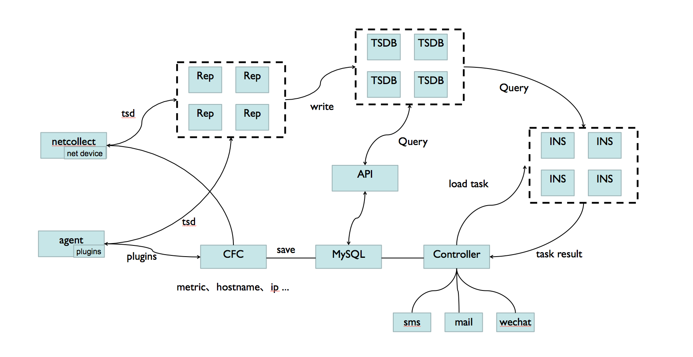

# OWL

​&nbsp;​&nbsp;​&nbsp;​&nbsp;​&nbsp;​&nbsp;OWL 是由国内领先的第三方数据智能服务商 [TalkingData](<https://www.talkingdata.com/>) 开源的一款企业级分布式监控告警系统，目前由 Tech Operation Team 持续开发更新维护。

&nbsp;&nbsp;&nbsp;&nbsp;&nbsp;&nbsp;OWL 后台组件全部使用 [Go](https://golang.org/) 语言开发，Go 语言是 Google 开发的一种静态强类型、编译型、并发型，并具有垃圾回收功能的编程语言，它的并发机制可以充分利用多核，同平台一次编译可以到处运行，运维成本极低，更多的信息可以参考[官方文档](https://golang.org/doc/)。前端页面使用 [iView](<https://github.com/iview/iview>) 开发，iView 同样是由 TalkingData 开源的一套基于 Vue.js 的 UI 组件库，主要服务于 PC 界面的中后台产品。

## Features

- Go语言开发，部署维护简单
- 分布式，支持多机房
- 多维的数据模型，类opentsdb
- 支持多种报警算法，支持多条件组合、时间范围、报警模板等
- 灵活的插件机制，支持任意语言编写，支持传参，自动同步到客户端
- 丰富的报警渠道，邮件、企业微信、短信、电话以及自定义脚本
- 原始数据永久存储，支持发送到 opentsdb、kairosdb、kafka
- 自带 web 管理界面以及强大的自定义图表功能能

## Architecture

## Components

**agent**：安装在每台被监控机器上，用于采集监控数据

**netcollect**：通过 SNMP V2 采集网络设备的接口数据

**repeater**：接收 `agent` 发送过来的监控数据，并写入后端存储

**cfc**：维护客户端需要执行的插件列表，主机名 、ip地址更新以及采集到的指标列表

**controller**：从数据库加载告警策略，生成任务发送给 `inspector`，并且根据执行结果进行告警

**inspector**：从 `controller` 获取监控任务，根据 `tsdb` 中的数据进行计算，并将结果返回 `controller`

**api**：对外提供 http rest api接口，web 页面就是通过它来获取数据

**MySQL**：所有配置信息的持久化存储，包含主机信息，告警策略，主机组，人员等

**TSDB**：时序数据库(time seires database)，用于存储采集到的监控数据

**frontend**：web 管理页面，可以方便的进行系统管理维护工作

## Demo

http://54.223.127.87/

普通用户：demo/demo  
管理员：admin/111111  
注: demo 环境数据库每隔 1 个小时会自动恢复

## rpm包地址
https://pan.baidu.com/s/1UTYOOB8YE8nng0guXOXkmg#list/path=%2Fowl

## 前端源码地址
https://github.com/TalkingData/owl-frontend

## QQ Group
492850035
